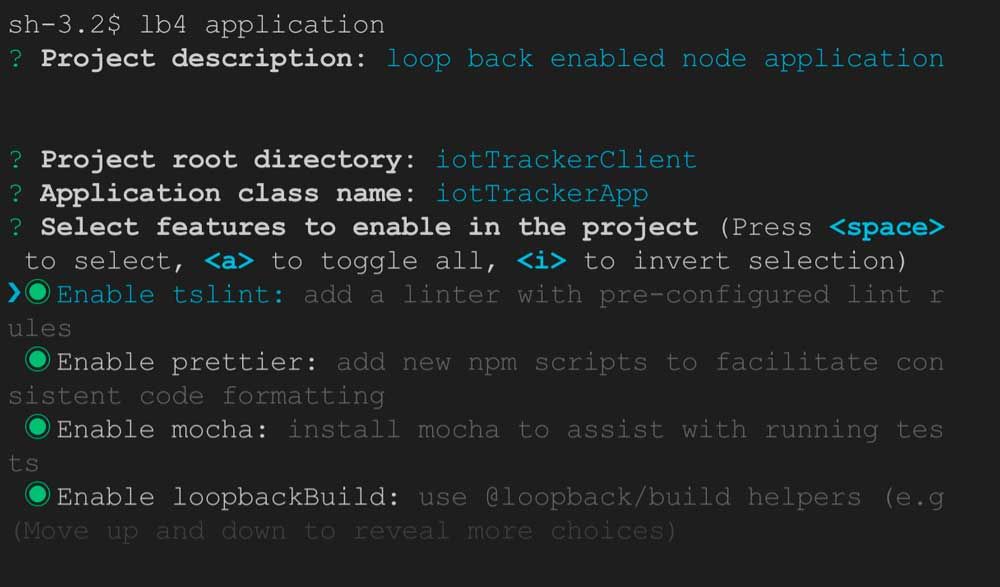
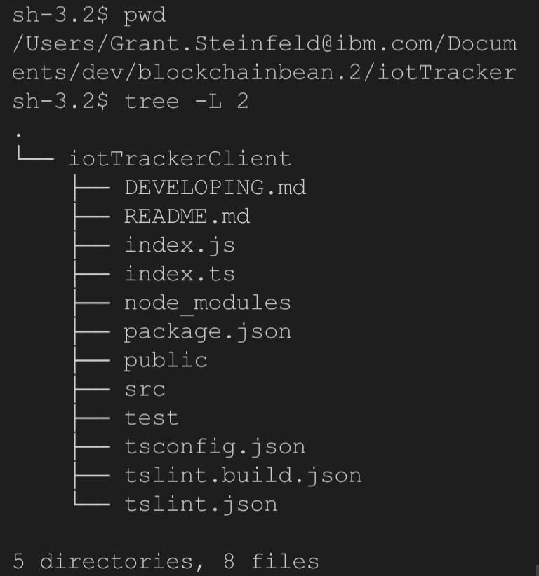
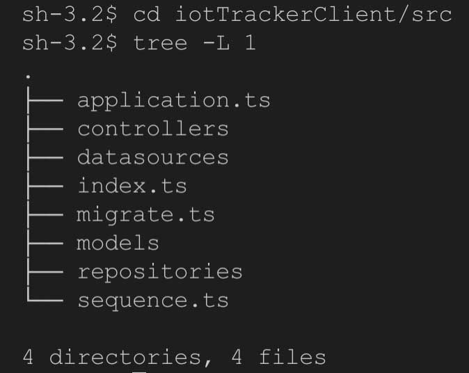

# Loopback
## Getting started
make sure you have nodeJS installed

## install loopback via npm
```sh
npm i -g @loopback/cli
```

## create loopback nodeJS project
Assume we are creating say an IotTracking application that needs a REST api.  Run this command
```sh
lb4 application
```

 Which will prompt you for the following:



This will create an empty loopback project, with a ping REST endpoint

You should now see in the application root ( e.g. in the iotTrackerClient dir )



and in the src folder the models and controllers:



After successfully running this command you should have stub code `ping.controller.ts` in your src/controllers directory 

### To view and test the /ping controller 

run:

```sh
npm start
```

By navigating to

[The localhost swagger REST explorer  ](http://127.0.0.1:3000/explorer/#/)

you will be able to browse and test the endpoints right from
your web browser.


For detailed information checkout the [loopback lb4 tutorial](https://loopback.io/doc/en/lb4/todo-tutorial.html)

[back to README](https://github.com/Grant-Steinfeld/migrate-hyperledger-composer-loopback/blob/master/README.md)
