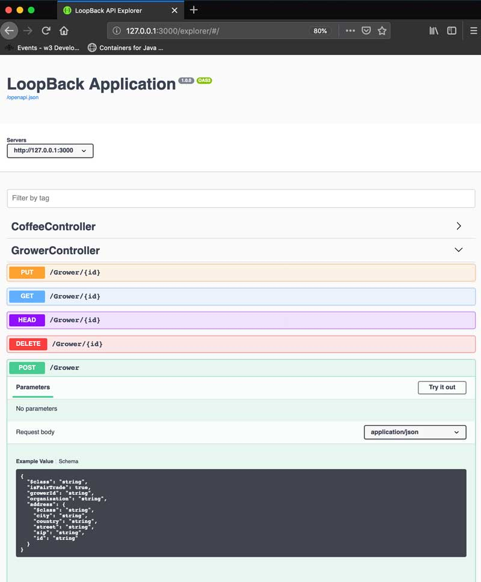

# Loopback
## Using swagger to generate code

If you have an REST API already defined (e.g. an existing Hyperledger Composer & Hyperledger Fabric blockchain project.) you should have access to it's swagger.json file.  If so it's relatively easy to download the file and generate your models and controllers.

### download the swagger.json
For example suppose I have a swagger test form.  In Firefox or Chrome, right mouse click on the screen and `inspect element` this should bring up your browsers debug panel.  Simply go to the network tab, and reload your page.
You should see an http/s call to swagger.json


Copy the swagger.json link to your clipboard.

### use loopback command line tooling to generate code
Make sure you have [an existing loopback application setup ](LOOPBACK-GETTING-STARTED.md)
first before generating code.

using the swagger.json URL generate code by using the following command in a terminal


```sh
lb4 openapi --url http://<<ipaddress/hostname>>/swagger.json --validate true
```

After successfully running this command you should have stub code in your src/controller directory and in your src/models directory

```sh
npm start
```

By navigating to

[The localhost swagger REST explorer  ](http://127.0.0.1:3000/explorer/#/)

you will be able to browse and test the endpoints right from
your web browser.




This will let you explore your API and test your endpoints  ... note they will all throw a not implemented exception until you wire up your controllers to something meaningful.


## Troubleshooting and resources


 Checkout the [loopback documentation about lb4 OpenAPI code generation](https://loopback.io/doc/en/lb4/OpenAPI-generator.html)

[back to Loopback notes](https://github.com/Grant-Steinfeld/migrate-hyperledger-composer-loopback/blob/master/README.md)
